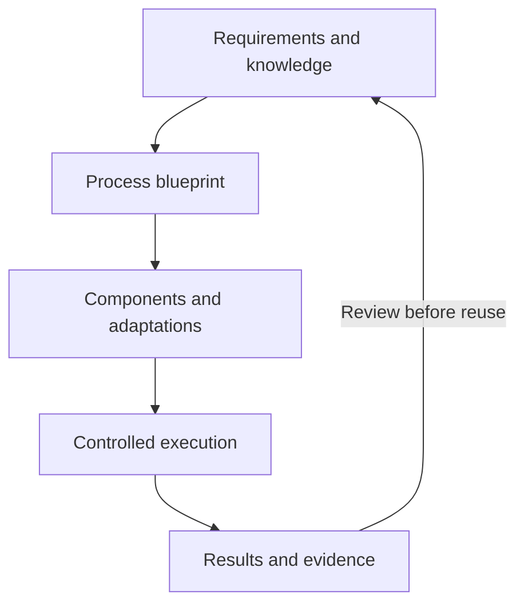

  <picture>
    <source media="(prefers-color-scheme: dark)" srcset="assets/brand/pansphaira-icon-negative.svg">
    <source media="(prefers-color-scheme: light)" srcset="assets/brand/pansphaira-icon-positive.svg">
    
  </picture>

# PanSphaira

**Enterprise software that adapts to the way your business works.**

A new approval rule, a different data source or a change of business system should not mean starting again. Yet adapting enterprise software often means choosing between custom development and fitting the process around the software.

PanSphaira is building an **AI-assisted software ecosystem** around the opposite idea: start with the business need, combine reusable capabilities and adapt the parts that depend on the context. Agents help interpret requirements and propose changes; explicit controls outside the agent determine what may run.

The aim is to reuse more than code. Sources, assumptions, interfaces, tests and results should travel with a solution, so the next person or agent can understand where it fits—and what needs checking again.

> **Current stage:** An open-source development project with runnable local demonstrations and published, bounded proofs. General end-to-end adaptation across live business systems remains a development direction, not an established product capability. [Inspect capabilities and evidence](docs/capabilities.md).

[**Understand the idea**](docs/explanation/overview.md) · [**Explore examples**](#applications) · [**Try the local demo**](#quickstart) · [**Discuss the underlying questions**](docs/explanation/research-questions.md)

## Applications

Each example illustrates a different part of the ecosystem, with a direct route to its own evidence.

### Check whether an invoice rule is supported

In the synthetic invoice example, the existing matching rule produces a verified match. Ask for a different price tolerance, and the changed requirement exposes a gap: there is no released executable variant for it yet.

**Shown today:** A bounded check against existing capabilities, with a working baseline and an explicit unsupported change—instead of a silently invented solution.

[Follow the invoice example](docs/use-cases/index.md#incoming-invoice-processing) · [Inspect its frozen proof](https://github.com/JoFe2/PANSPHAIRA/releases/tag/ap-06-frozen-adapted-erv-proof-probe-with-narrow-go-verdict-issue-366-95ecd4d587d9)

### Connect analysis without handing over control

KaleidoSphere can help explore data and inspect analytical results. It is an independent BI system, connected through PanSphaira's optional, versioned interface. PanSphaira controls the admitted requests; KaleidoSphere owns the analytics and its runtime.

**Shown today:** A bounded compatibility and intent contract for the declared product pair. Using analytical findings to improve processes is a broader direction; a new independent release does not automatically qualify a new pairing or an autonomous improvement loop.

[Understand the connection](docs/use-cases/index.md#connected-analysis) · [Inspect the exact contract](docs/EXTERNAL-BI-SERVICE.md)

### Keep the business function stable when a provider changes

Two systems may express the same order operation using different fields, permissions and recovery actions. Reusing a business capability should not require its consumer to understand every provider detail.

**Shown today:** One target-neutral order capability with two local synthetic provider bindings. ERP is an optional example of system adaptation, not a prerequisite for the ecosystem.

[Explore provider adaptation](docs/use-cases/index.md#provider-adaptation) · [Inspect the local proof](docs/CAPABILITY-CELL-ERP-ORDER.md)

## How the pieces fit together

The project calls this approach **Adaptive Knowledge Engineering**: connect what a process needs with reusable knowledge and software, then keep the adaptation and its results inspectable.

<!-- diagram-source: docs/diagrams/concept-loop.mmd; keep the block generated from that source. -->

*Conceptual model, not a generally automated pipeline. Reviewed results inform the next candidate; they do not grant permission to activate it.*

- **Knowledge and requirements:** the intended outcome, sources, assumptions and constraints.
- **Capabilities and processes:** the business functions and process variants needed to achieve it.
- **Software and adaptation:** implementations, configuration and system-specific bindings.
- **Integration and verification:** permitted execution, observation of the resulting state and evidence for review.

These are connected perspectives, not four mandatory services. The [overview](docs/explanation/overview.md) explains the model; the [architecture tour](docs/explanation/architecture-tour.md) follows an action through its responsibilities.

## Reuse the knowledge behind a solution

A successful example is not enough to establish where a component can be reused. A later developer or agent needs its sources, assumptions, tested conditions and known failures. When those conditions change, the affected conclusion needs review.

Agents can help with interpretation, planning and exceptions. Deterministic software remains appropriate for precisely specified calculations and actions. Knowing how an operation works is separate from having permission to perform it.

[Knowledge and reuse](docs/explanation/knowledge-and-reuse.md) explains the idea with a concrete example. The [Canon](docs/CANON.md) and [Knowledge Harvest](docs/KNOWLEDGE-HARVEST.md) retain the exact rules.

## Build privately. Extend it together.

Keep your own process definitions, adaptations and evidence private, or propose selected material for shared reuse under the [contribution rules](CONTRIBUTING.md). Contributions can include domain knowledge, design questions, tests, adapters and documentation—not only code.

The library can grow with new needs. Each contribution still needs its own applicability and evidence; adding a component does not make every combination valid.

## What is available, and what comes next?

**Available to inspect:** Bounded local demonstrations, the examples above, their source and published evidence. The release history also includes a separately named [signed offline-updater increment](https://github.com/JoFe2/PANSPHAIRA/releases/tag/v0.3.0-offline-updater.1) for its declared local synthetic profile.

**Development direction:** Broader cross-system adaptation, reusable knowledge whose applicability can be reevaluated, and cooperation between process execution and analysis. Follow the [roadmap](docs/roadmap.md) and the [open research questions](docs/explanation/research-questions.md) for work beyond the published proofs.

**For deeper inspection:** [Capability evidence](docs/capabilities.md), [security assurance](docs/SECURITY-ASSURANCE.md) and [known limitations](docs/KNOWN-LIMITATIONS.md) identify their own scope and, where applicable, historical evidence boundaries.

## Quickstart

The runnable demo is a **fictional CRM/ERP workflow**: inspect allowed, denied and escalated actions and their visible results. It is separate from the invoice proof above.

Use a development or disposable **Linux x86_64** host. The documented prerequisites include Docker Engine with Compose v2, Node.js 24 and npm 11 within the [declared version ranges](package.json), `jq`, `curl`, OpenSSL and `sha256sum`.

Follow the [Quickstart](docs/QUICKSTART.md) to choose a source or artifact, verify it and install the demo. `READY_VERIFIED` is the documented installation-readiness result; the guide also explains the loopback entry points and how to remove only owned resources. Use fictional data, not production systems or real business records.

## Choose your next step

- **Understand the concept:** [Overview](docs/explanation/overview.md) → [Knowledge and reuse](docs/explanation/knowledge-and-reuse.md) → [Research questions](docs/explanation/research-questions.md).
- **Follow an example:** [Application guide](docs/use-cases/index.md) → the selected example's exact contract and evidence.
- **Run or extend it:** [Quickstart](docs/QUICKSTART.md) → [Architecture tour](docs/explanation/architecture-tour.md) → [Contributing](CONTRIBUTING.md).

The [documentation hub](docs/README.md) connects these routes. Technical readers can go directly to the [Canon](docs/CANON.md) or [Architecture](docs/ARCHITECTURE.md).

## Releases and evidence

Use the [release history](https://github.com/JoFe2/PANSPHAIRA/releases) to inspect what a particular release contains. **Source, runnable packaging and execution evidence are different identities.** GitHub's Latest label is not itself a promise of an installable archive; each release page and [release governance](docs/RELEASE-GOVERNANCE.md) define the applicable artifacts and limits.

## Project and community

[Discuss ideas](https://github.com/JoFe2/PANSPHAIRA/discussions), [contribute](CONTRIBUTING.md), [get support](SUPPORT.md), or report a vulnerability through the [private security route](SECURITY.md).

Code is [Apache-2.0](LICENSE). See [NOTICE](NOTICE), [third-party notices](THIRD_PARTY_NOTICES.md) and [citation metadata](CITATION.cff).

Voluntary creator support: [Ko-fi](https://ko-fi.com/chimpmaera) · [Buy Me a Coffee](https://buymeacoffee.com/jimpansky).
