# Architecture tour: from a proposal to an observed result

This page explains responsibilities before introducing implementation detail. It is a reading guide to the [Canon](../CANON.md) and [Architecture](../ARCHITECTURE.md), not a replacement contract.

## The participants have different jobs

A business requirement describes the desired outcome and constraints. An agent can propose a process or an action. Trusted software validates the admitted operation and its context; policy and any required approval determine whether that exact operation may proceed. A system-specific binding performs the allowed effect. Readback observes what the target actually did, and a receipt records the supported result.

Knowing how to call a system does not grant permission to call it. Likewise, a transport response saying a request was accepted is not sufficient evidence that the intended business state exists.

This diagram illustrates the governed path. Policy rejection, missing required approval or inadequate readback must not turn into a success record. It does not assert that every current or future adapter implements this complete lifecycle.

## Separate meaning from the provider

The business capability expresses the operation in target-neutral terms. Provider bindings account for system-specific fields, rights and recovery behavior. The [provider-adaptation example](../use-cases/index.md#provider-adaptation) demonstrates this with a bounded local order capability.

An independently owned external component keeps its own responsibilities. For example, [KaleidoSphere owns BI](../EXTERNAL-BI-SERVICE.md); PanSphaira admits only the declared versioned intents. Ownership separation does not imply compatibility with every independent release.

## Connect evidence to later work, not automatic authority

Results can help identify a reusable pattern or reveal an unsupported case. Before reuse, the candidate still needs qualification for the new context. A previous success, a record in a knowledge library or an agent's recommendation is not an activation decision.

See [Knowledge and reuse](knowledge-and-reuse.md) for the conceptual path and [Governed Knowledge Harvest](../KNOWLEDGE-HARVEST.md) for its exact maturity states.

## Inspect the implementation boundaries

- [Secure-default proof](../SECURE-DEFAULT-PROOF.md): declared local proof path and its reproduction command.
- [Security assurance](../SECURITY-ASSURANCE.md): dated claims, evidence and external limits.
- [Known limitations](../KNOWN-LIMITATIONS.md): what the evidence does not establish.
- [Quickstart](../QUICKSTART.md): local entry point; not production deployment instructions.

[Back to the overview](overview.md) · [Documentation hub](../README.md)
