# Reuse the knowledge behind a solution

A working component answers only part of the next developer's question. The developer also needs to know why it was built that way, which inputs and assumptions mattered, and whether those conditions still hold.

PanSphaira's knowledge-reuse direction connects the artifact with its sources, transformations, decisions, tests and results. This is not the same as treating a copied conversation or an agent's memory as established knowledge.

## What should travel with a candidate?

- The intended outcome and the source of the relevant facts.
- Assumptions, applicability conditions and system dependencies.
- The selected adaptation and the alternatives that were rejected.
- Positive and negative test evidence, plus unresolved questions.
- Review, version and expiry information needed to evaluate later reuse.

A change to a source or assumption can invalidate dependent conclusions. Preserving that connection makes reevaluation possible; it is not a claim that arbitrary knowledge is automatically kept correct.

## Qualification is a separate step

This is a reading model, not the exact promotion state machine. [Governed Knowledge Harvest](../KNOWLEDGE-HARVEST.md) defines the actual maturity levels, required record fields and review boundaries. Nothing in the diagram grants authority to run a component.

## Example: a matching rule

A local invoice-matching example can establish what happened for particular synthetic records and one declared rule. It does not establish that a changed tolerance is supported, that extracted real-world documents are accurate or that the same rule is appropriate in another organization.

Useful reuse preserves both the successful baseline and the unsupported changed requirement. The latter is information about where not to claim a working solution. See the [invoice proof](../use-cases/index.md#incoming-invoice-processing).

## Where agents and deterministic software meet

An agent may propose a mapping, retrieve relevant sources or identify a possible pattern. Deterministic checks can validate fixed schemas, numeric rules and declared invariants. Neither role removes the need for evidence about applicability, and qualification is distinct from permission to execute.

## Questions worth investigating

How much evidence is enough for a new context? Which assumptions need to be rechecked? How can conflicting findings and negative results remain useful rather than disappearing from the record? These are [research questions](research-questions.md), not closed claims of general transfer learning.

[Overview](overview.md) · [Architecture tour](architecture-tour.md) · [Documentation hub](../README.md)
