# A software ecosystem that starts with the business need

Enterprise software often fixes the available process first. A changed approval rule, a new source of data or a replacement system then creates another customization project.

PanSphaira explores the opposite approach: describe the intended outcome and constraints, identify reusable business capabilities, and adapt the parts that depend on the context. Its aim is an AI-assisted ecosystem, not one application with a fixed list of workflows.

## One idea, several connected perspectives

This is a conceptual model. It is not a claim that every arrow is generally automated or available. Review informs a later candidate; evidence alone never grants execution permission.

- **Knowledge and requirements:** what should happen, what is known, where that knowledge came from and which assumptions matter.
- **Capabilities and processes:** the business functions, process variants and control requirements needed for the outcome.
- **Software and adaptation:** concrete components, configuration, data mappings and system-specific bindings.
- **Integration and verification:** permitted execution, observation of the resulting state and evidence for later review.

These are perspectives on connected work, not a prescription to deploy four separate services.

## A recognizable example

An incoming-invoice process may need an additional approval or different matching tolerance. A useful adaptation process should determine whether an existing variant supports the need, identify what must change, and keep an unsupported requirement visible.

The [invoice example](../use-cases/index.md#incoming-invoice-processing) makes that question concrete through a narrow synthetic proof. It does not establish general document understanding or automatic adaptation of any invoice process.

## Where agents help

Agents can assist with interpretation, planning, selecting candidate capabilities and handling exceptions. Deterministic software remains useful where behavior must be precise and repeatable. Observation and analysis can inform an improvement proposal, but execution remains subject to the declared controls.

[The architecture tour](architecture-tour.md) explains those responsibilities. [Knowledge and reuse](knowledge-and-reuse.md) explains why sources and tests must travel with the candidate.

## Current implementation and wider direction

Published local proofs establish bounded parts of this approach. They include an invoice adaptation probe, a target-neutral capability with synthetic provider bindings, and an optional contract to the independent KaleidoSphere BI system.

A generally available, end-to-end ecosystem that adapts arbitrary live business processes is the wider direction. It is not established by combining the individual demonstrations. Use the [application guide](../use-cases/index.md), [capability matrix](../capabilities.md) and [release history](https://github.com/JoFe2/PANSPHAIRA/releases) to inspect the actual scope.

## Continue reading

- [Applications](../use-cases/index.md): what the examples demonstrate and where their evidence stops.
- [Research questions](research-questions.md): problems that remain open.
- [Canon](../CANON.md) and [Architecture](../ARCHITECTURE.md): exact rules and technical design.
- [Documentation hub](../README.md): all reading routes.
