# Applications: different views of the same ecosystem

The examples below illustrate how business needs, reusable functions, system-specific adaptation and explicit controls can fit together. They are deliberately different in scope. A local proof in one example does not qualify all examples or arbitrary combinations.

## Incoming-invoice processing

**Business question:** Which matching and approval capabilities support a changed incoming-invoice requirement, and where is new implementation still needed?

**Inspected proof:** The frozen AP-06 probe gives a narrow result for synthetic inputs. The baseline reaches `MATCHED` through the released core: the existing rule confirms the match. A changed 200-bps tolerance (2%) has no released executable variant and remains `UNKNOWN`: support for that changed rule is not established, so no successful execution is claimed.

This is a useful illustration of requirements meeting an existing capability library. It is not an assertion of general invoice automation. The real OCR/Document-AI pilot remains separate from the synthetic extraction and matching chain.

- [Frozen proof release](https://github.com/JoFe2/PANSPHAIRA/releases/tag/ap-06-frozen-adapted-erv-proof-probe-with-narrow-go-verdict-issue-366-95ecd4d587d9)
- [Invoice chain and bounded evidence](../INCOMING-INVOICE-PROVING-GROUND.md)
- [Real Document-AI pilot boundary](https://github.com/JoFe2/PANSPHAIRA/issues/378)

## Connected analysis

**Business question:** How can an agent explore analytical questions while the analytics system retains ownership of its runtime and operations?

**Inspected implementation:** PanSphaira connects through an optional, default-off, versioned interface to the independent KaleidoSphere system. The canonical contract identifies the exact product/contract pair and admitted status, discovery, analysis, planning, preview and readback intents. PanSphaira does not acquire a general SQL or database-write interface through that contract.

Analytical findings may inform later improvement proposals. The contract alone does not establish an autonomous optimization loop or compatibility with every new KaleidoSphere release. Some broader local integrations have separate evidence; use their exact release and scope rather than silently extending this contract.

- [External BI contract and exact compatible pair](../EXTERNAL-BI-SERVICE.md)
- [KaleidoSphere project and independent releases](https://github.com/JoFe2/KaleidoSphere)
- [Capability and evidence overview](../capabilities.md)

## Provider adaptation

**Business question:** Can the consumer of a business capability stay stable while the target system's request format and permissions change?

**Inspected proof:** The local synthetic `erp.order.create v1` proof uses one target-neutral consumer contract with two provider bindings. The bindings handle provider-specific mappings, effective rights and compensating rollback within the declared example.

ERP is one optional application of the adaptation mechanism, not a required foundation of PanSphaira. The example does not establish general provider interchangeability or production rollback guarantees.

- [Provider-adaptation contract and proof](../CAPABILITY-CELL-ERP-ORDER.md)
- [Architecture tour](../explanation/architecture-tour.md)

## Choose the evidence before drawing a conclusion

Each case has its own input conditions, artifacts and limits. The [capability matrix](../capabilities.md), [security assurance](../SECURITY-ASSURANCE.md) and [release history](https://github.com/JoFe2/PANSPHAIRA/releases) provide the deeper records. Historical evidence remains bound to its original scope; roadmap issues do not replace execution evidence.

[Overview](../explanation/overview.md) · [Knowledge and reuse](../explanation/knowledge-and-reuse.md) · [Documentation hub](../README.md)
